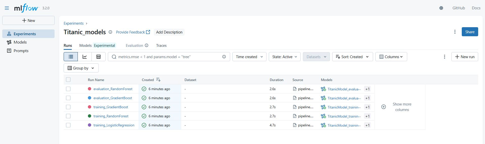
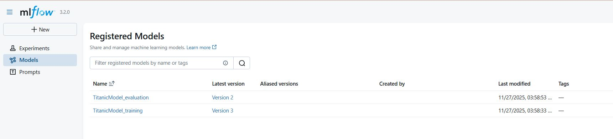
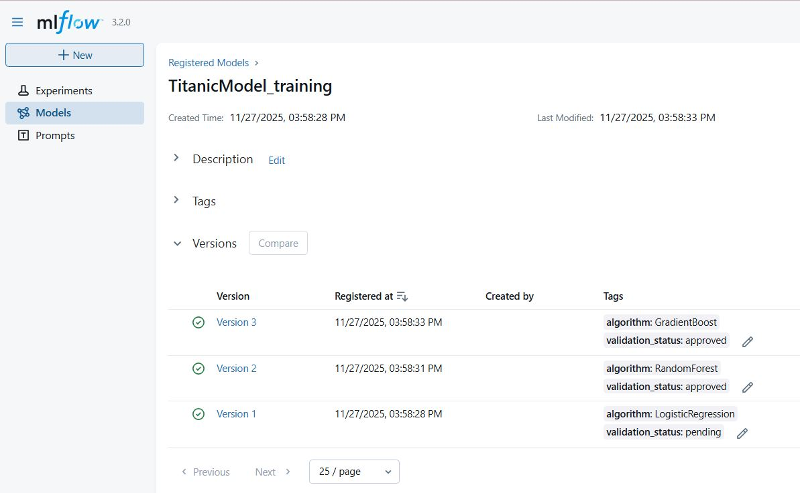

#### A machine learning experimentation project with MLflow
A machine learning experimentation project that tracks runs, tunes parameters, compares models, and manages model version using MLflow

#### Project Components  
- Data Transformation
    - Handle missing data 
    - Ensure data formats are consistent
    - Standardise features
- Data Training
    - Train baseline models (e.g. Logistic Regression, Random Forest, Gradient Boosting)
    - Track experiment runs with MLflow. Information such as model artifacts, model parameters, output metrics (e.g. accuracy)  are logged 
    - Register each trained model in MLflow registry
    - Within the model registry, models are grouped in stages for easy comparison
        - Data Training stage - Contains all baseline models
        - Data Evaluation stage - Contains the top models that are promoted from baseline models and underwent hyperparameter tuning 
- Data Inference 
    - The final, tuned model is applied to the test dataset to generate the predictions
- Data Pipeline
    - Run the data pipeline that orchestrates all the steps - data transformation, training, inference

#### Running the project
- Start the local MLflow tracking server 
 ```mlflow server --backend-store-uri="mysql+pymysql://username@hostname:port/database" --default-artifact-root=s3://your-bucket --host=0.0.0.0 --port=5000```

- Run the data pipeline script

- Open the MLflow UI ```http://localhost:5000```
    - Experiment tab    

    - Model registry  



#### References 
https://www.kaggle.com/competitions/titanic/data  
https://mlflow.org/docs/latest/self-hosting/architecture/backend-store/  
https://mlflow.org/docs/latest/ml/tracking/tutorials/remote-server/  